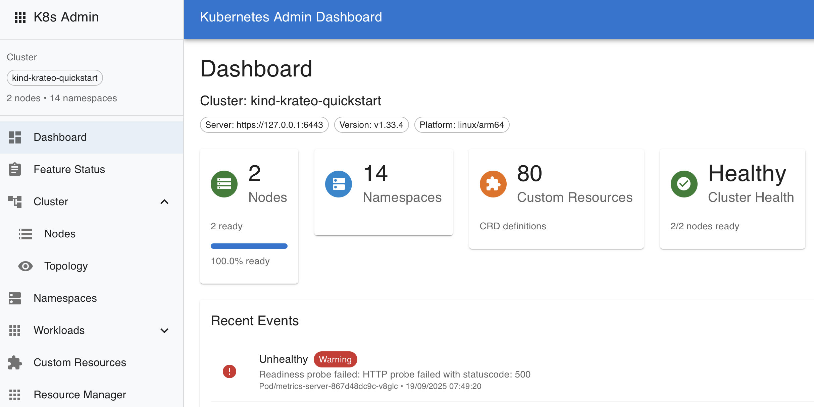

# Kubernetes Admin UI (YAKUI - Yet Another Kubernetes UI)

A modern, comprehensive React-based web interface for Kubernetes cluster administration with full-stack API integration, advanced resource management, and enterprise-grade features.

[](https://github.com/brunseba/yakui/releases/latest)
[](LICENSE)
[](deployment/docker/README.docker-optimization.md)
[](docs/CRD_COMPOSER_PHASE_3_SUMMARY.md)
[](docs/)


## 📋 Table of Contents

- [Overview](#overview)
- [Features](#features)
- [Quick Start](#-quick-start-guide)
- [Documentation](#-documentation)
- [Architecture](#-architecture)
- [API Endpoints](#api-endpoints)
- [Testing](#testing)
- [Contributing](#contributing)
- [License](#license)

## Overview



## ✨ Key Highlights

- **🎨 CRD Canvas Composer**: Interactive visual editor for Custom Resource Definitions with drag-and-drop functionality
- **🔗 Advanced CRD Relationships**: Automated detection and visualization of CRD-to-CRD dependencies
- **⚡ High Performance**: Optimized API endpoints with smart caching and relationship analysis
- **📊 Multi-Cluster Support**: Seamless switching between different Kubernetes clusters
- **🔐 Enterprise Security**: Full RBAC integration with multiple authentication methods
- **🚀 Developer Experience**: Modern React/TypeScript stack with comprehensive tooling

## Features

### 🔐 Authentication & Security
- **Native Kubernetes RBAC Integration**: Uses Kubernetes service accounts and RBAC for authentication
- **Multiple Authentication Methods**: 
  - Default kubeconfig (`~/.kube/config`)
  - Custom kubeconfig content
  - Service account tokens
- **Secure Design**: Built with security-first principles and proper error handling
- **Session Management**: Persistent authentication states with secure token handling

### 🌐 Cluster Management
- **Cluster Topology Visualization**: Interactive cluster node visualization with health status
- **Real-time Dashboard**: Cluster overview with key metrics and recent events
- **Node Management**: View node details, resource capacity, and health status
- **Multi-Cluster Support**: Connect and switch between different Kubernetes clusters

### 🏗️ Advanced Resource Management
- **Full Resource CRUD Operations**: Create, read, update, and delete Kubernetes resources
- **Multi-Resource Support**: 
  - Deployments with replica scaling and status monitoring
  - Services with endpoint discovery and load balancer information
  - Pods with real-time status, logs, and container details
  - ConfigMaps and Secrets with secure data management
- **Resource Detail Views**: Comprehensive resource information with related resources
- **YAML Editor**: Monaco-based editor with syntax highlighting and validation
- **Resource Templates**: Pre-built templates for quick resource creation

### 📊 Namespace & Organization
- **Namespace CRUD Operations**: Create, view, and delete namespaces with labels and annotations
- **Resource Quotas**: Monitor and manage resource limits per namespace
- **Multi-Namespace Views**: Switch between namespaces or view cluster-wide resources
- **Custom Resource Definitions (CRDs)**: Discover and manage CRDs by API groups

### 👥 RBAC Administration
- **Service Account Management**: View and manage service accounts across namespaces
- **Role & Role Binding Management**: Comprehensive RBAC role administration
- **Permissions Matrix**: Visual representation of permissions and bindings
- **Security Context Analysis**: Review and manage pod security contexts

### 🎨 CRD Canvas Composer (New!)
- **Interactive Visual Editor**: Drag-and-drop interface for Custom Resource Definitions
- **Real-time Relationship Analysis**: Automated detection of CRD-to-CRD dependencies
- **Smart Grid Layout**: Intelligent positioning with relationship-aware auto-layout
- **Schema Property Explorer**: Comprehensive CRD schema inspection and editing
- **Export & Import**: Save and load CRD canvas configurations
- **Performance Optimized**: Fast analysis with optimized backend API endpoints

### 🔍 Enhanced Monitoring & Observability
- **Real-time Cluster Events**: Monitor cluster events with filtering and search
- **Pod Logs Viewer**: 
  - Real-time log streaming
  - Multi-container pod support
  - Log filtering and search capabilities
  - Download logs functionality
- **Resource Events**: Track resource-specific events and status changes
- **Resource Metrics**: CPU, memory, and storage utilization (when metrics-server is available)
- **Health Checks**: Comprehensive cluster and resource health monitoring

### 🚀 Developer Experience
- **Hot Reload Development**: Fast development cycle with Vite
- **Comprehensive Testing**: Unit tests with Vitest and React Testing Library
- **TypeScript Support**: Full type safety with extensive type definitions
- **Error Boundaries**: Graceful error handling with user-friendly error messages
- **Development Server**: Built-in mock API server for local development

### 💻 Modern UI/UX
- **Responsive Design**: Works seamlessly on desktop, tablet, and mobile devices
- **Hamburger Menu Navigation**: Collapsible sidebar with organized menu structure
- **Material Design**: Modern Material-UI v5 components with consistent theming
- **Dark/Light Theme Support**: Adaptable to user preferences
- **Accessibility**: WCAG compliant with keyboard navigation support
- **Performance Optimized**: Lazy loading and efficient re-rendering

## 🚀 Quick Start Guide

### Latest Updates

> **🎆 New Feature**: CRD Canvas Composer - Interactive visual editor for Custom Resource Definitions with advanced relationship analysis!
> 
> **🗜️ Documentation**: All documentation has been organized in the [`docs/`](docs/) directory for better accessibility.

### Project Structure

```
📁 yakui/
├── 📱 app/              # Application source code
│   ├── src/            # React TypeScript source
│   ├── public/         # Static assets  
│   └── index.html      # App entry point
├── ⚙️ config/           # All configuration files
│   ├── vite.config.ts  # Build configuration
│   ├── tsconfig*.json  # TypeScript configs
│   └── *.config.*      # Other configs
├── 🔧 tools/           # Development tools
│   ├── dev-server.cjs  # API development server
│   ├── Taskfile.yml    # Task automation
│   └── scripts/        # Development scripts
├── 🚀 deployment/      # Deployment configurations
│   ├── docker/         # Docker configs (90% faster!)
│   └── kub/           # Kubernetes manifests
└── 📚 docs/            # Documentation
```

### Prerequisites
- **Node.js 18+** and npm
- **Access to a Kubernetes cluster** (local or remote)
- **kubectl configured** with appropriate RBAC permissions
- **Docker** (optional, with optimized build pipeline)

### Development Setup

#### Option 1: Using Task Runner (Recommended)

This project includes a [Taskfile](https://taskfile.dev/) for streamlined development workflow management:

1. **Install Task** (if not already installed):
   ```bash
   # macOS
   brew install go-task/tap/go-task
   
   # Linux/macOS
   sh -c "$(curl --location https://taskfile.dev/install.sh)" -- -d
   ```

2. **Quick start with Task**:
   ```bash
   git clone <repository-url>
   cd kubernetes-admin-ui
   
   # Fresh development start (installs deps + starts dev servers)
   task fresh
   
   # Show all available tasks
   task --list
   ```

#### Option 2: Traditional npm commands

1. **Clone and install dependencies**
   ```bash
   git clone <repository-url>
   cd kubernetes-admin-ui
   npm install
   ```

2. **Start the full development stack**
   ```bash
   # Start both backend API and frontend in one command
   npm run dev:full
   
   # Or start them separately:
   npm run dev:api    # Backend API server on port 3001
   npm run dev        # Frontend on port 5173
   ```

3. **Access the application**
   - **Frontend**: http://localhost:5173
   - **Backend API**: http://localhost:3001
   - **Health Check**: http://localhost:3001/api/health

4. **Verify the setup**
   ```bash
   npm run health     # Check API health
   npm run version    # Get API version
   npm run status     # Combined health and version check
   ```

### Authentication Methods

#### Method 1: Default Kubeconfig (Recommended for local development)
- Select "Default Config" tab
- Click "Connect to Cluster"
- Uses `~/.kube/config` automatically

#### Method 2: Custom Kubeconfig
- Select "Custom Config" tab
- Paste your kubeconfig YAML content
- Click "Connect to Cluster"

#### Method 3: Service Account Token
- Select "Token Auth" tab
- Enter your service account token
- Click "Connect to Cluster"

## 🐳 Optimized Docker Development 

> **⚡ 90% Faster Builds!** Our Docker setup now includes BuildKit optimizations, smart caching, and hybrid deployment options.

### 🏁 Performance Improvements
- **Build Time**: 4-5 minutes → **25-30 seconds** (90% faster!)
- **Hot Reload**: Instant with bind mounts
- **Kubernetes Access**: Fully working with optimized configurations
- **Permission Issues**: Completely resolved

### Prerequisites
- **Docker** and **Docker Compose** installed
- **BuildKit enabled** (automatic with Docker 20.10+)
- **Access to a Kubernetes cluster** with kubeconfig available
- **kubectl configured** with appropriate RBAC permissions

### 🚀 Quick Start Options

#### Option 1: Hybrid Setup (Fastest - Recommended)
```bash
git clone <repository-url>
cd kubernetes-admin-ui

# Fast frontend build (25 seconds)
cd deployment/docker
export DOCKER_BUILDKIT=1
docker build --cache-from docker-frontend:latest \
  --tag docker-frontend:latest \
  --file Dockerfile.dev-frontend ../..

# Start frontend container
docker-compose -f docker-compose.fast.yml up frontend -d

# Start backend on host (instant Kubernetes access)
cd ../.. && npm run dev:api
```

#### Option 2: Fast Build Script (Interactive)
```bash
git clone <repository-url>
cd kubernetes-admin-ui/deployment/docker

# Interactive optimized build
./build-fast.sh

# Follow prompts for frontend/backend
```

#### Option 3: Traditional Docker (Optimized)
```bash
git clone <repository-url>
cd kubernetes-admin-ui

# Use optimized compose configuration
docker compose -f deployment/docker/docker-compose.fast.yml up

# Or with backend profile
docker compose -f deployment/docker/docker-compose.fast.yml --profile backend up
```

3. **Access the application**
   - **Frontend**: http://localhost:5173
   - **Backend API**: http://localhost:3001
   - **Health Check**: http://localhost:3001/api/health

4. **Optional services**
   ```bash
   # Enable Redis caching
   docker compose -f deployment/docker/docker-compose.yml --profile cache up -d
   
   # Enable Prometheus monitoring
   docker compose -f deployment/docker/docker-compose.yml --profile monitoring up -d
   
   # Access Prometheus: http://localhost:9090
   ```

### Docker Development Commands

```bash
# Build images
docker compose -f deployment/docker/docker-compose.yml build

# Rebuild specific service
docker compose -f deployment/docker/docker-compose.yml build frontend
docker compose -f deployment/docker/docker-compose.yml build backend

# View service status
docker compose -f deployment/docker/docker-compose.yml ps

# View logs
docker compose -f deployment/docker/docker-compose.yml logs -f frontend
docker compose -f deployment/docker/docker-compose.yml logs -f backend

# Execute commands in containers
docker compose -f deployment/docker/docker-compose.yml exec frontend npm run test
docker compose -f deployment/docker/docker-compose.yml exec backend npm run diagnostics

# Stop services
docker compose -f deployment/docker/docker-compose.yml down

# Stop and remove volumes
docker compose -f deployment/docker/docker-compose.yml down -v
```

### Development Features

- **🔄 Hot Reload**: File changes automatically trigger rebuilds
- **📁 Volume Mounts**: Source code is mounted for live editing
- **🔍 Health Checks**: All services include health monitoring
- **🌐 Networking**: Services communicate via Docker network
- **📊 Monitoring**: Optional Prometheus integration
- **💾 Persistence**: Redis data and Prometheus metrics persist across restarts

### Kubernetes Configuration

The Docker setup mounts your local kubeconfig:
- Host: `~/.kube/config` → Container: `/home/node/.kube/config`
- Ensure your kubeconfig is accessible and contains the correct context
- The backend service runs as non-root user for security

### Troubleshooting Docker Development

**Permission Issues:**
```bash
# Fix kubeconfig permissions
chmod 600 ~/.kube/config

# Check container user
docker compose -f deployment/docker/docker-compose.yml exec backend whoami
```

**Network Connectivity:**
```bash
# Test backend health
curl http://localhost:3001/api/health

# Check service connectivity
docker compose -f deployment/docker/docker-compose.yml exec frontend curl http://backend:3001/api/health
```

**File Watching Issues:**
```bash
# For file watching issues on some systems
export CHOKIDAR_USEPOLLING=true
docker compose -f deployment/docker/docker-compose.yml up
```

## Production Deployment

### Docker Build
```bash
# Build the Docker image
docker build -f deployment/docker/Dockerfile -t k8s-admin-ui:latest .

# Run locally
docker run -p 8080:8080 k8s-admin-ui:latest
```

### Kubernetes Deployment
```bash
# Deploy to Kubernetes
kubectl apply -f deployment/kub/k8s-deployment.yaml

# Port forward for local access
kubectl port-forward -n k8s-admin-ui service/k8s-admin-ui 8080:80
```

## Available Scripts

### Development
- `npm run dev` - Start frontend development server (port 5173)
- `npm run dev:api` - Start backend API server (port 3001)
- `npm run dev:full` - Start both backend and frontend concurrently
- `npm run preview` - Preview production build

### Testing
- `npm run test` - Run tests in watch mode
- `npm run test:ui` - Run tests with UI interface
- `npm run test:run` - Run tests once
- `npm run test:coverage` - Run tests with coverage report
- `npm run test:watch` - Run tests in watch mode

### Build & Production
- `npm run build` - Build for production (TypeScript + Vite)
- `npm run lint` - Run ESLint for code quality

### Utilities
- `npm run health` - Check backend API health
- `npm run version` - Get backend API version
- `npm run status` - Combined health and version check
- `npm run validate:config` - Validate environment configuration
- `npm run diagnostics` - Generate system diagnostics report
- `npm run kill:dev` - Kill running development servers

## 🏷️ Architecture

### v2.0.0 Organized Project Structure
Built with modern web technologies, clean separation of concerns, and optimized development workflow:

**Frontend Stack:**
- **React 19** with TypeScript for type-safe development
- **Material-UI (MUI) v7** for consistent, accessible UI components
- **React Router v7** for client-side routing
- **TanStack Query v5** for advanced server state management
- **Monaco Editor** for YAML/JSON editing with syntax highlighting
- **Vite** for lightning-fast development and optimized builds

**Backend Stack:**
- **Node.js Express** API server with TypeScript support
- **Native Kubernetes Client** (`@kubernetes/client-node`)
- **CORS-enabled** for secure cross-origin requests
- **Environment-based** configuration management

**Development & Testing:**
- **Vitest** for fast unit testing with React Testing Library
- **ESLint** for code quality and consistency
- **TypeScript** for compile-time error checking
- **Concurrently** for parallel development server management

**Deployment:**
- **Docker** with multi-stage builds for production
- **Kubernetes** manifests for container orchestration
- **GitHub Actions** ready workflows for CI/CD

## Security

The application implements security best practices:
- RBAC-based authentication
- Read-only permissions by default
- Secure container configuration
- Security headers and CSP

## Components Implemented

### ✅ Core Components (Production Ready)
- **🔐 Authentication System**: Multi-method auth with persistent sessions
- **📊 Dashboard**: Cluster overview with real-time metrics and events
- **🌐 Cluster Topology**: Interactive node visualization with health indicators
- **📁 Namespace Manager**: Full CRUD operations with resource quotas
- **🎛️ Resource Manager**: Complete resource lifecycle management
  - Deployments with scaling and status monitoring
  - Services with endpoint and load balancer info
  - Pods with real-time logs and container details
  - ConfigMaps and Secrets with secure data handling
- **🎨 CRD Canvas Composer**: Interactive visual CRD editor with relationship analysis
- **🔧 CRD Manager**: Custom Resource Definition discovery and management
- **👥 RBAC Manager**: Service accounts, roles, and bindings administration
- **📱 Responsive Layout**: Material-UI with collapsible navigation

### 🚧 Advanced Features (In Development)
- **📈 Metrics Integration**: Enhanced metrics with Prometheus integration
- **🔄 Resource Scaling**: Horizontal Pod Autoscaler management
- **🌍 Multi-Cluster**: Switch between multiple Kubernetes clusters
- **📋 Resource Templates**: Custom resource templates and wizards
- **🔒 Security Scanning**: Built-in security vulnerability assessment

### 🎯 Planned Features
- **💾 Backup & Restore**: Cluster and resource backup management
- **🔍 Advanced Search**: Full-text search across all resources
- **📊 Custom Dashboards**: User-configurable monitoring dashboards
- **🔔 Alerting**: Resource-based alerting and notifications
- **🔌 Helm Integration**: Helm chart management and deployment

## 📚 Documentation

Comprehensive documentation is available in the [`docs/`](docs/) directory:

### 🚀 Getting Started
- [Quick Start Guide](docs/QUICK-START.md) - Get up and running in minutes
- [Configuration Guide](docs/CONFIGURATION_GUIDE.md) - Detailed configuration options
- [Cluster Validation](docs/CLUSTER_VALIDATION.md) - Cluster setup and validation

### 🎨 Features
- [CRD Canvas Composer](docs/CRD_COMPOSER_PHASE_3_SUMMARY.md) - Interactive CRD editor
- [CRD Relationships](docs/CNPG_CRD_RELATIONSHIPS.md) - Advanced relationship analysis
- [Schema Properties](docs/SCHEMA-PROPERTIES-SUMMARY.md) - Schema inspection tools

### 🔧 Development
- [Debug Commands](docs/debug-commands.md) - Debugging and troubleshooting
- [Canvas Test Guide](docs/canvas-test-guide.md) - Testing the CRD Canvas
- [Error Fixes](docs/ERROR_FIXES_SUMMARY.md) - Common issues and solutions

### 🚀 Deployment
- [Docker Setup](deployment/docker/README.md) - Containerized deployment
- [Kubernetes Deployment](deployment/kub/README.md) - K8s cluster deployment
- [Multi-cluster Integration](docs/MULTICLUSTER_INTEGRATION.md) - Multi-cluster setup

## API Endpoints

The backend API provides comprehensive REST endpoints:

### Authentication
- `POST /api/auth/login` - Authenticate with kubeconfig or token
- `GET /api/health` - API health check
- `GET /api/version` - API version information

### Cluster Resources
- `GET /api/nodes` - List cluster nodes
- `GET /api/namespaces` - List namespaces with metrics
- `POST /api/namespaces` - Create namespace
- `DELETE /api/namespaces/:name` - Delete namespace
- `GET /api/namespaces/:name` - Get namespace details

### Resource Management
- `GET /api/resources/deployments` - List deployments
- `GET /api/resources/services` - List services
- `GET /api/resources/pods` - List pods
- `GET /api/resources/configmaps` - List config maps
- `GET /api/resources/secrets` - List secrets
- `GET /api/resources/:type/:namespace/:name` - Get resource details
- `GET /api/resources/:type/:namespace/:name/events` - Get resource events
- `GET /api/resources/:type/:namespace/:name/related` - Get related resources
- `GET /api/resources/pod/:namespace/:name/logs` - Get pod logs
- `DELETE /api/resources/:type/:namespace/:name` - Delete resource

### Discovery & CRD Analysis
- `GET /api/crds` - List Custom Resource Definitions
- `GET /api/crds/:name` - Get CRD details
- `GET /api/events` - List cluster events
- `GET /api/resources` - List all Kubernetes resources
- `GET /api/dependencies/crd-relationships` - Get CRD-to-CRD relationships (optimized)
- `GET /api/dependencies/dictionary` - Get CRD schema analysis
- `GET /api/dependencies/crd/apigroups` - List CRD API groups
- `GET /api/dependencies/crd/enhanced` - Enhanced CRD analysis

## Testing

Comprehensive testing setup with modern tools:

```bash
# Run all tests
npm run test

# Run tests with UI (recommended for development)
npm run test:ui

# Run tests once (CI mode)
npm run test:run

# Generate coverage report
npm run test:coverage
```

### Test Structure
- **Unit Tests**: Component-level testing with React Testing Library
- **Integration Tests**: API endpoint testing
- **E2E Tests**: User workflow testing (planned)
- **Visual Regression**: Component snapshot testing

## Contributing

We follow modern development practices:

1. **Conventional Commits**: All commits follow conventional commit standards
2. **Pre-commit Hooks**: Automated linting and testing
3. **TypeScript**: Strict type checking enabled
4. **ESLint**: Consistent code style enforcement
5. **Git Flow**: Feature branch workflow with PR reviews

### Development Workflow

1. Fork and clone the repository
2. Create a feature branch: `git checkout -b feature/your-feature`
3. Make changes following the coding standards
4. Run tests: `npm run test`
5. Commit with conventional commit format
6. Push and create a Pull Request

## Task Runner

This project includes a comprehensive Taskfile for development workflow management using [Taskfile.dev](https://taskfile.dev/).

**Common Task commands:**
```bash
task fresh       # Fresh development start
task dev         # Start development servers  
task clean:dev   # Clean and restart
task ports       # Check port usage
task health      # Check application health
task --list      # Show all available tasks
```

## License

MIT License - see [LICENSE](LICENSE) file for details.

---

<div align="center">

**YAKUI (Yet Another Kubernetes UI)**

*Modern Kubernetes Administration with Interactive CRD Management*

Built with ❤️ for the Kubernetes community

[Documentation](docs/) • [Features](#features) • [Quick Start](#-quick-start-guide) • [Contributing](#contributing)

</div>
