# CloudNativePG (CNPG) CRD Relationships Analysis 🐘

## 🎯 **API Group: postgresql.cnpg.io**

Analysis of the relationships between Custom Resource Definitions (CRDs) in the CloudNativePG operator ecosystem.

---

## 🏗️ **CRD Architecture Overview**

CloudNativePG follows a **hub-and-spoke** architecture pattern where the `Cluster` CRD is the central resource that other CRDs reference.

```mermaid
graph TD
    C[🗄️ Cluster<br/>postgresql.cnpg.io/v1] --> |manages| P1[PostgreSQL Pod 1]
    C --> |manages| P2[PostgreSQL Pod 2]  
    C --> |manages| P3[PostgreSQL Pod N]
    
    B[💾 Backup<br/>postgresql.cnpg.io/v1] -.->|spec.cluster| C
    SB[🔄 ScheduledBackup<br/>postgresql.cnpg.io/v1] -.->|spec.cluster| C  
    PL[🏊 Pooler<br/>postgresql.cnpg.io/v1] -.->|spec.cluster| C
    
    C -.->|bootstrap.initdb.secret| S1[🔐 Secret]
    C -.->|superuserSecret| S2[🔐 Secret]
    C -.->|certificateRefs| S3[🔐 Secret]
    
    style C fill:#e1f5fe
    style B fill:#f3e5f5  
    style SB fill:#f3e5f5
    style PL fill:#e8f5e8
```



---

## 📊 **Main CRDs in postgresql.cnpg.io**

### **1. 🗄️ Cluster** *(Central Hub)*
```yaml
apiVersion: postgresql.cnpg.io/v1
kind: Cluster
```
- **Purpose**: Primary CRD defining PostgreSQL cluster topology and configuration
- **Scope**: Namespaced
- **Role**: Central resource that others reference
- **Manages**: PostgreSQL instances, storage, networking, backup retention

### **2. 💾 Backup** *(Spoke)*
```yaml
apiVersion: postgresql.cnpg.io/v1
kind: Backup  
```
- **Purpose**: Defines individual backup operations
- **Scope**: Namespaced
- **References**: `spec.cluster` → Cluster name
- **Manages**: One-time backup execution

### **3. 🔄 ScheduledBackup** *(Spoke)*
```yaml
apiVersion: postgresql.cnpg.io/v1
kind: ScheduledBackup
```
- **Purpose**: Automated backup scheduling with cron expressions
- **Scope**: Namespaced  
- **References**: `spec.cluster` → Cluster name
- **Manages**: Recurring backup schedules

### **4. 🏊 Pooler** *(Spoke)*
```yaml  
apiVersion: postgresql.cnpg.io/v1
kind: Pooler
```
- **Purpose**: Connection pooling (PgBouncer) for PostgreSQL clusters
- **Scope**: Namespaced
- **References**: `spec.cluster` → Cluster name  
- **Manages**: Connection pooling service and configuration

---

## 🔗 **Relationship Matrix**

| Source CRD | Target Resource | Relationship Type | Field Reference | Purpose |
|------------|-----------------|-------------------|-----------------|---------|
| **Backup** | Cluster | `reference` | `.spec.cluster` | Backup source cluster |
| **ScheduledBackup** | Cluster | `reference` | `.spec.cluster` | Scheduled backup source |
| **Pooler** | Cluster | `reference` | `.spec.cluster` | Pooling target cluster |
| **Cluster** | Secret | `reference` | `.spec.bootstrap.initdb.secret` | Init database credentials |
| **Cluster** | Secret | `reference` | `.spec.superuserSecret` | Superuser credentials |
| **Cluster** | Secret | `reference` | `.spec.certificates.*` | TLS certificates |

---

## 📋 **Detailed Relationship Analysis**

### **🔄 Backup → Cluster**
```yaml
apiVersion: postgresql.cnpg.io/v1
kind: Backup
metadata:
  name: my-backup
spec:
  cluster: my-cluster  # ← References Cluster.metadata.name
  target: primary
```
- **Type**: `reference` (strong)
- **Cardinality**: Many Backups → One Cluster
- **Dependency**: Backup cannot exist without referenced Cluster
- **Purpose**: Identifies which cluster to backup

### **🔄 ScheduledBackup → Cluster**
```yaml
apiVersion: postgresql.cnpg.io/v1
kind: ScheduledBackup
metadata:
  name: daily-backup
spec:
  cluster: my-cluster  # ← References Cluster.metadata.name
  schedule: "0 2 * * *"
```
- **Type**: `reference` (strong)  
- **Cardinality**: Many ScheduledBackups → One Cluster
- **Dependency**: ScheduledBackup cannot function without referenced Cluster
- **Purpose**: Identifies cluster for scheduled backups

### **🔄 Pooler → Cluster**
```yaml
apiVersion: postgresql.cnpg.io/v1
kind: Pooler
metadata:
  name: my-pooler
spec:
  cluster: my-cluster  # ← References Cluster.metadata.name
  type: rw
  instances: 3
```
- **Type**: `reference` (strong)
- **Cardinality**: Many Poolers → One Cluster  
- **Dependency**: Pooler cannot connect without referenced Cluster
- **Purpose**: Identifies cluster for connection pooling

### **🔄 Cluster → Secret**
```yaml
apiVersion: postgresql.cnpg.io/v1
kind: Cluster
metadata:
  name: my-cluster
spec:
  superuserSecret: postgres-superuser  # ← References Secret.metadata.name
  bootstrap:
    initdb:
      secret: postgres-initdb           # ← References Secret.metadata.name
```
- **Type**: `reference` (optional)
- **Cardinality**: One Cluster → Many Secrets
- **Dependency**: Optional - cluster can auto-generate secrets
- **Purpose**: External credential management

---

## 🎯 **Relationship Patterns**

### **Hub-and-Spoke Architecture** 
```
    Backup ──┐
             │
ScheduledBackup ──┼──> Cluster (Hub)
             │
    Pooler ──┘
```

### **Resource Lifecycle Dependencies**
1. **Cluster** must exist first (foundation)
2. **Backup/ScheduledBackup/Pooler** reference existing Cluster
3. **Secrets** can be pre-created or auto-generated by Cluster
4. **Operator** manages runtime relationships and reconciliation

### **Ownership and Cleanup**
- Cluster **owns** its managed PostgreSQL pods and services
- Backup/ScheduledBackup/Pooler are **independent** resources
- Deleting Cluster **does not** automatically delete referencing resources
- Orphaned references result in **reconciliation errors**

---

## 🔍 **Canvas Visualization Preview**

When using these CRDs in your Canvas Composer, you would see:

```
┌─────────────┐     ┌─────────────┐     ┌─────────────┐
│   Backup    │────▶│   Cluster   │◀────│   Pooler    │
│             │     │             │     │             │
└─────────────┘     └─────────────┘     └─────────────┘
                            ▲
                            │
                    ┌─────────────┐
                    │ScheduledBackup│
                    │             │  
                    └─────────────┘
```

**Visual Indicators:**
- **Blue lines** (reference relationships)
- **Thick lines** (strong dependencies)
- **Arrows** pointing toward referenced resources
- **Cluster** positioned centrally as the hub

---

## 🚀 **Using Canvas with CNPG CRDs**

### **Step 1: Add Cluster to Canvas**
- Drag `Cluster` CRD to canvas center
- This becomes your PostgreSQL foundation

### **Step 2: Add Related Resources**  
- Add `Backup`, `ScheduledBackup`, or `Pooler` CRDs
- **Relationship lines automatically appear** connecting to Cluster

### **Step 3: View Relationships**
- **Right panel** shows detailed relationship information
- Click relationship entries to **navigate between related CRDs**
- Use **relationship filter** to show/hide specific connection types

### **Step 4: Smart Layout**
- Click **Relationship Layout** button for intelligent positioning
- Related CRDs automatically arrange around central Cluster
- Strong relationships position resources closer together

---

## 🔧 **Operational Relationships**

Beyond schema relationships, CNPG CRDs have **runtime operational relationships**:

### **Data Flow Dependencies**
- **Backup** → reads from → **Cluster** database
- **ScheduledBackup** → triggers → **Backup** creation  
- **Pooler** → connects to → **Cluster** database endpoints

### **Status Propagation**
- **Cluster** status affects **Backup** success/failure
- **Backup** status updates **ScheduledBackup** last run info
- **Pooler** status reflects **Cluster** connection health

### **Configuration Inheritance** 
- **Backup** inherits storage config from **Cluster**
- **Pooler** inherits connection params from **Cluster**
- **ScheduledBackup** inherits backup settings from **Cluster**

---

## 📈 **Summary Statistics**

- **Total CRDs**: 4 main resources
- **Relationship Types**: Primarily `reference` relationships  
- **Architecture**: Hub-and-spoke with Cluster as central hub
- **Dependency Strength**: Strong references (required for operation)
- **Cardinality**: Many-to-one relationships pointing to Cluster

**The postgresql.cnpg.io API group demonstrates a clean, well-structured relationship model perfect for Canvas visualization! 🎯**

---

*Analysis generated: December 22, 2024*  
*CNPG Version: v1 API*  
*Canvas Integration: Fully supported*