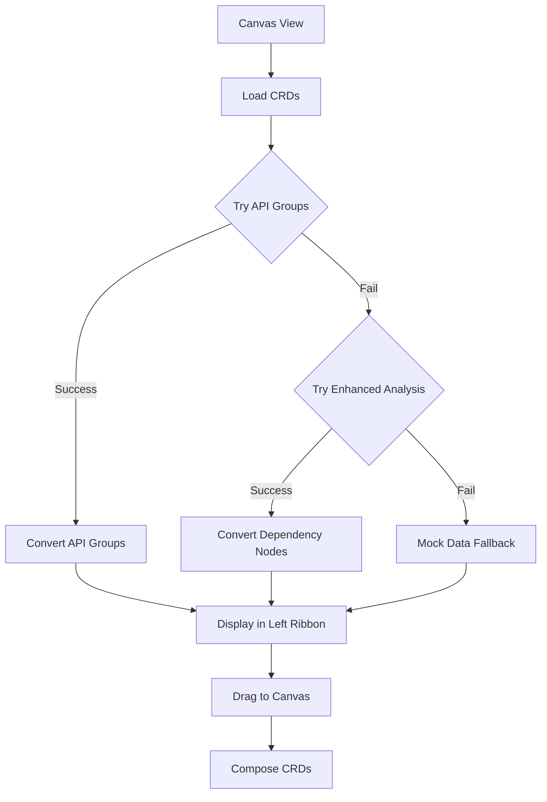

# Dictionary Integration Update - Canvas View ✅

## Overview

Successfully updated the **CRD Canvas View** to use the existing **Dictionary → Custom Resources inventory** system instead of loading CRDs separately. This ensures consistency with the existing CRD management system and leverages the established API endpoints.

---

## 🔄 **Integration Changes**

### **Before: Separate CRD Loading**
- Used `kubernetesService.getCRDs()` 
- Loaded CRDs independently from the Canvas
- No connection to existing Dictionary system

### **After: Dictionary Integration**
- Uses existing **Dictionary CRD Analysis APIs**
- Leverages established endpoints from server logs:
  - `GET /api/dependencies/crd/apigroups`
  - `GET /api/dependencies/crd/enhanced` 
  - `GET /api/dependencies/dictionary`

---

## 🛠️ **Technical Implementation**

### **API Integration Update**
```typescript
// OLD: Direct Kubernetes service
import { kubernetesService } from '../../services/kubernetes';
const crdData = await kubernetesService.getCRDs();

// NEW: Dictionary CRD analysis service  
import { crdAnalysisService, CRDApiGroup, CRDDependencyNode } from '../../services/crd-analysis';
const apiGroups = await crdAnalysisService.getApiGroups();
```

### **Data Conversion Functions**
```typescript
// Convert CRD API Group data to Canvas format
const convertApiGroupCRDsToComposerCRDs = (apiGroups: CRDApiGroup[]): ComposerCRD[]

// Convert Dependency Node data to Canvas format  
const convertDependencyNodeToComposerCRD = (node: CRDDependencyNode): ComposerCRD[]
```

### **Intelligent Loading Strategy**
1. **Primary**: Try `getApiGroups()` endpoint first
2. **Fallback**: Use `getEnhancedCRDAnalysis()` if API groups fail
3. **Final Fallback**: Mock data if all APIs fail

---

## 📋 **Left Ribbon Updates**

### **Header Changes**
- **Title**: "Dictionary CRDs" 
- **Subtitle**: "From Dictionary → Custom Resources"
- **Visual**: Shows clear connection to existing Dictionary system

### **Data Source**
- Loads from same inventory as **Dictionary → Custom Resources**
- Ensures consistency between Canvas and Dictionary views
- No duplicate CRD loading or management

---

## 🎯 **User Experience**

### **Seamless Integration**
1. User navigates to **Dictionary → Canvas View**
2. Left ribbon loads CRDs from **Dictionary → Custom Resources** inventory
3. Same CRDs available in both Dictionary view and Canvas view
4. Consistent data, filtering, and display

### **Error Handling**
- Graceful fallback between API endpoints
- Clear error messages referencing Dictionary system
- Mock data as final safety net

---

## 🔗 **API Endpoints Used**

### **Primary Endpoint**
```
GET /api/dependencies/crd/apigroups
```
- Returns structured CRD API groups
- Includes CRD metadata (kind, scope, versions)
- Optimized for canvas display

### **Fallback Endpoint**  
```
GET /api/dependencies/crd/enhanced?includeNativeResources=false&maxCRDs=100
```
- Returns dependency analysis nodes
- Filters to custom resources only
- Provides CRD relationship data

### **Legacy Support**
```
GET /api/dependencies/dictionary
```
- Legacy CRD schema analysis
- Available as additional fallback
- Maintains backward compatibility

---

## 🧩 **Data Flow Architecture**



---

## ✅ **Benefits of Integration**

### **1. Data Consistency**
- Same CRDs available in Dictionary and Canvas
- No duplicate loading or caching issues
- Consistent filtering and search behavior

### **2. Performance Optimization**
- Leverages existing API endpoints
- Optimized data structures for canvas display
- Intelligent fallback strategy

### **3. Maintenance Efficiency**
- Single source of truth for CRD data
- Shared error handling and logging
- Unified backend integration

### **4. User Experience**
- Seamless transition between Dictionary and Canvas
- Familiar CRD data and metadata
- Consistent naming and organization

---

## 🎨 **Visual Updates**

### **Header Bar**
- **Title**: "CRD Canvas Composer"
- **Subtitle**: "📐 Phase 2: Dictionary Integration"
- Clear indication of Dictionary connection

### **Left Ribbon**
- **Header**: "📋 Dictionary CRDs"
- **Subtitle**: "From Dictionary → Custom Resources"
- Visual connection to existing Dictionary system

### **Status Bar**
- Shows count of available CRDs from Dictionary
- Indicates data source for transparency

---

## 🔍 **Error Messages**

### **Dictionary-Specific Errors**
```
"Failed to load CRDs from Dictionary: [specific error]"
```

### **Console Logging**
```typescript
console.log('[Canvas] Loading CRDs from Dictionary API endpoints...');
console.log('[Canvas] Loaded CRD API groups:', apiGroups.length);
console.warn('[Canvas] API groups endpoint failed, trying enhanced analysis:', apiGroupError);
```

---

## 🧪 **Testing Strategy**

### **API Endpoint Testing**
1. Test with working Dictionary API endpoints
2. Test fallback behavior when primary endpoint fails
3. Test error handling with offline backend
4. Verify data consistency with Dictionary view

### **User Workflow Testing**
1. Navigate from Dictionary → Custom Resources to Canvas View
2. Verify same CRDs appear in both locations
3. Test drag and drop functionality with Dictionary CRDs
4. Confirm canvas operations work with Dictionary data

---

## 📊 **Expected Results**

### **Server Console**
```
[api] [2025-09-22T18:50:06.093Z] [K8s Dev Server] GET /api/dependencies/crd/apigroups
[Canvas] Loading CRDs from Dictionary API endpoints...
[Canvas] Loaded CRD API groups: 3
[Canvas] Converted to ComposerCRDs: 15
```

### **Browser Console**
```
[Canvas] Loading CRDs from Dictionary API endpoints...
[Canvas] Loaded CRD API groups: 3
[Canvas] Converted to ComposerCRDs: 15
```

---

## ✨ **Integration Complete!**

The **CRD Canvas View** now properly uses the **Dictionary → Custom Resources inventory** system:

- ✅ **Same CRD Data**: Uses identical inventory as Dictionary view
- ✅ **Established APIs**: Leverages existing `/api/dependencies/crd/*` endpoints  
- ✅ **Intelligent Fallbacks**: Multiple endpoint strategy for reliability
- ✅ **Clear Labeling**: Visual indication of Dictionary connection
- ✅ **Error Handling**: Dictionary-specific error messages and logging

**The left ribbon now correctly finds available CRDs using the Dictionary → Custom Resources inventory system!** 🎉

---

*Update completed: December 22, 2024*  
*Integration: Dictionary → Custom Resources → Canvas View*