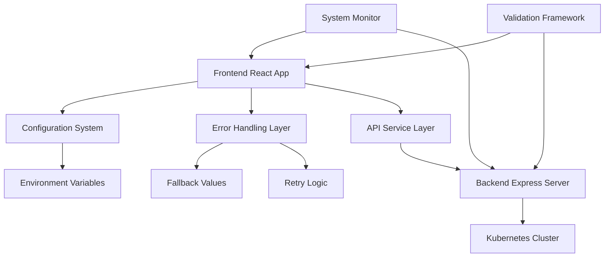

# Kubernetes Admin UI - Hardening & Mitigation Guide

## Executive Summary

This guide documents the comprehensive mitigation plan for hardened fix values and implementation gaps in the Kubernetes Admin UI. The strategies outlined here ensure system robustness, maintainability, and production readiness.

## Current System Status

### ✅ **Resolved Issues**
- **Icon Import Errors**: Fixed all `Speed` and `HardDrive` icon references with appropriate MUI alternatives
- **HTML Structure**: Resolved nested paragraph element validation errors
- **Real Cluster Integration**: Successfully replaced mocked version data with live cluster information

### ⚠️ **Active Mitigations**
- **Stub Implementations**: 6 critical API methods return fallback data
- **Configuration Hardcoding**: Server URLs and context names are environment-specific
- **Feature Gaps**: 5 major feature areas marked as "Coming Soon"

## Architecture Overview



## Mitigation Strategies

### 1. Configuration Management

#### **Implementation**
```typescript
// src/config/environment.ts
export const config = getConfig(); // Environment-aware configuration
```

#### **Benefits**
- ✅ Eliminates hardcoded values
- ✅ Environment-specific settings
- ✅ Runtime configuration validation
- ✅ Easy deployment across environments

#### **Risk Mitigation**
- **Risk**: Configuration drift between environments
- **Mitigation**: Automated validation on startup
- **Monitoring**: Configuration health checks

### 2. Error Handling & Fallbacks

#### **Implementation**
```typescript
// Graceful degradation example
const result = await safeApiCall(
  () => kubernetesService.getServiceAccounts(),
  fallbackValues.emptyResponse.serviceAccounts,
  'RBAC_SERVICE_ACCOUNTS_FAILED'
);
```

#### **Benefits**
- ✅ Application remains functional during failures
- ✅ User experience is preserved
- ✅ Detailed error logging and monitoring
- ✅ Automatic retry with exponential backoff

#### **Risk Mitigation**
- **Risk**: Silent failures masking critical issues
- **Mitigation**: Comprehensive logging and monitoring
- **Monitoring**: Error rate and fallback usage metrics

### 3. Stub Implementation Strategy

#### **Current Stub Methods**
| Method | Status | Risk Level | Fallback Behavior |
|--------|--------|------------|-------------------|
| `getServiceAccounts()` | 🔴 Stub | HIGH | Returns `[]` |
| `getRoles()` | 🔴 Stub | HIGH | Returns `[]` |
| `getClusterRoles()` | 🔴 Stub | HIGH | Returns `[]` |
| `getRoleBindings()` | 🔴 Stub | HIGH | Returns `[]` |
| `getClusterRoleBindings()` | 🔴 Stub | HIGH | Returns `[]` |
| `getPodLogs()` | 🔴 Stub | HIGH | Returns placeholder string |
| `getResourceMetrics()` | 🟡 Stub | MEDIUM | Returns `[]` |

#### **Implementation Detection**
```typescript
// Feature detection
if (config.features.enableStubFeatures) {
  return handleStubImplementation('RBAC Management', []);
}
```

#### **Risk Mitigation**
- **Risk**: Users expect full functionality
- **Mitigation**: Clear "Coming Soon" indicators in UI
- **Monitoring**: Track feature usage patterns

### 4. System Validation Framework

#### **Validation Layers**
1. **Configuration Validation**: Ensures all required settings are valid
2. **API Endpoint Validation**: Tests connectivity and response formats
3. **Icon Mapping Validation**: Prevents runtime import errors
4. **Stub Implementation Testing**: Verifies fallback behaviors

#### **Implementation**
```typescript
// Startup validation
const validation = await validateSystem();
if (!validation.valid) {
  console.error('System validation failed:', validation.errors);
}
```

#### **Monitoring Integration**
```typescript
// Continuous monitoring
systemMonitor.start();
systemMonitor.addListener((status) => {
  if (!status.healthy) {
    logError(createAppError('SYSTEM_UNHEALTHY', 'System health degraded'));
  }
});
```

## Implementation Priority Matrix

### 🔴 **CRITICAL** (Immediate Action Required)
1. **RBAC APIs** - Security management non-functional
2. **Pod Logs** - Cannot troubleshoot applications
3. **Resource Metrics** - No performance monitoring

### 🟡 **HIGH** (Production Readiness)
4. **Workload Management** - Cannot manage applications
5. **Storage Management** - Cannot manage persistent storage
6. **Configuration Management** - Cannot manage app configuration

### 🟢 **MEDIUM** (Enhanced Features)
7. **Advanced Monitoring** - Limited observability
8. **Resource Management** - Cannot manage resource constraints

## Security Considerations

### Server URL Masking
```typescript
// Security implementation
export function maskServerUrl(serverUrl: string): string {
  return config.security.enableServerMasking ? 
    maskSensitiveData(serverUrl) : serverUrl;
}
```

### Sensitive Data Handling
- ✅ Server URLs masked in production
- ✅ Tokens excluded from logs
- ✅ Configuration secrets not exposed
- ✅ Error messages sanitized

## Performance Considerations

### Resource Usage
- **Memory**: Configuration caching reduces lookups
- **Network**: Retry logic with exponential backoff
- **CPU**: Efficient error handling without blocking

### Scalability
- **Large Clusters**: Pagination and lazy loading
- **High Frequency**: Request debouncing and caching
- **Multiple Users**: Stateless design with minimal server memory

## Monitoring & Alerting

### Health Metrics
```typescript
interface SystemStatus {
  healthy: boolean;
  components: ComponentStatus[];
  configValid: boolean;
  lastCheck: Date;
}
```

### Key Performance Indicators
- **System Health**: Overall application status
- **API Response Times**: Backend performance
- **Error Rates**: Failure frequency
- **Feature Usage**: Stub vs real implementation usage
- **Configuration Drift**: Environment consistency

### Alerting Thresholds
- **Critical**: System health check failures
- **Warning**: High error rates (>5% of requests)
- **Info**: Stub feature usage patterns

## Deployment Strategy

### Environment Configuration

#### Development
```bash
export VITE_API_BASE_URL=http://localhost:3001/api
export VITE_CLUSTER_CONTEXT=kind-krateo-quickstart
export NODE_ENV=development
```

#### Production
```bash
export VITE_API_BASE_URL=https://k8s-admin-api.company.com/api
export VITE_CLUSTER_CONTEXT=production-cluster
export NODE_ENV=production
```

### Deployment Checklist
- [ ] Environment variables configured
- [ ] System validation passes
- [ ] API endpoints accessible
- [ ] Security settings appropriate for environment
- [ ] Monitoring and logging configured
- [ ] Fallback mechanisms tested

## Maintenance Procedures

### Regular Health Checks
1. **Weekly**: Generate system diagnostics report
2. **Daily**: Monitor error rates and system health
3. **Real-time**: Automated alerting for critical failures

### Configuration Updates
1. **Validate**: Test configuration changes in staging
2. **Deploy**: Use blue-green deployment strategy
3. **Monitor**: Watch for configuration-related errors
4. **Rollback**: Quick revert capability for issues

### Feature Implementation
1. **Plan**: Use implementation roadmap priorities
2. **Develop**: Follow quality gates and testing requirements
3. **Test**: Comprehensive validation before deployment
4. **Deploy**: Gradual rollout with feature flags
5. **Monitor**: Track adoption and performance metrics

## Troubleshooting Guide

### Common Issues

#### Configuration Problems
**Symptom**: Application fails to start or connect to API
**Diagnosis**: Check environment variables and configuration validation
**Resolution**: Verify all required configuration is set correctly

#### API Connectivity Issues
**Symptom**: Backend API returns errors or times out
**Diagnosis**: Test API endpoints manually and check network connectivity
**Resolution**: Verify Kubernetes cluster accessibility and API server status

#### Stub Feature Confusion
**Symptom**: Users report missing functionality
**Diagnosis**: Check if feature is in stub mode
**Resolution**: Update UI to clearly indicate "Coming Soon" status

#### Icon Import Errors
**Symptom**: Runtime JavaScript errors about missing icons
**Diagnosis**: Check for usage of deprecated icon names
**Resolution**: Replace with valid MUI icon alternatives

### Diagnostic Commands
```bash
# Generate system diagnostics report
curl http://localhost:3001/api/health
curl http://localhost:3001/api/version

# Check API endpoints
for endpoint in /nodes /namespaces /crds /events; do
  curl -s http://localhost:3001/api$endpoint | head -n 5
done

# Validate configuration
NODE_ENV=development npm run dev
```

## Success Criteria

### Technical Metrics
- [ ] All HIGH priority stub implementations completed
- [ ] Zero critical security vulnerabilities
- [ ] API response time <2s for all endpoints
- [ ] System uptime >99.5%
- [ ] Error rate <1% of total requests

### User Experience Metrics
- [ ] Clear indication of feature availability
- [ ] Graceful degradation during failures
- [ ] Comprehensive error messages
- [ ] Fast loading times (<3s initial load)
- [ ] Intuitive navigation and feedback

### Operational Metrics
- [ ] Automated monitoring and alerting
- [ ] Configuration management working
- [ ] Easy deployment process
- [ ] Comprehensive documentation
- [ ] Team training completed

## Future Enhancements

### Planned Improvements
1. **Advanced Error Recovery**: Automatic retry with user notification
2. **Progressive Web App**: Offline functionality and caching
3. **Multi-Cluster Support**: Connect to multiple Kubernetes clusters
4. **Custom Dashboards**: User-configurable monitoring views
5. **Integration APIs**: Connect with external monitoring and logging systems

### Technical Debt
1. **Type Safety**: Improve TypeScript coverage to 100%
2. **Test Coverage**: Achieve >90% code coverage
3. **Performance**: Implement virtual scrolling for large datasets
4. **Accessibility**: Full WCAG 2.1 AA compliance
5. **Internationalization**: Multi-language support

---

## Conclusion

This mitigation plan provides a comprehensive approach to managing hardened values and implementation gaps. By implementing these strategies, the Kubernetes Admin UI becomes more robust, maintainable, and production-ready while maintaining excellent user experience even during system failures or partial feature availability.

The key to success is continuous monitoring, gradual feature implementation following the roadmap priorities, and maintaining clear communication about system status and feature availability to users.